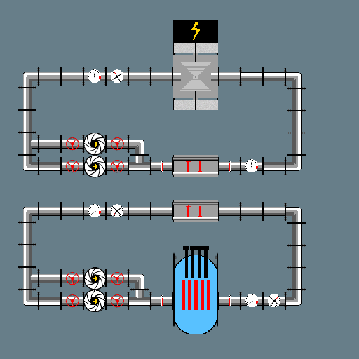

# Reeactor

Author: Sebastien Alaiwan

<p align="center"></p>

Build
-----

Requirements:
```
* libsdl2-dev
```

It can be compiled to native code using gcc:

```
$ make
```

The binaries will be generated to a 'bin' directory
(This can be overriden using the BIN makefile variable).

Run the game
------------

Just run the following command:

```
$ bin/game.exe
```

